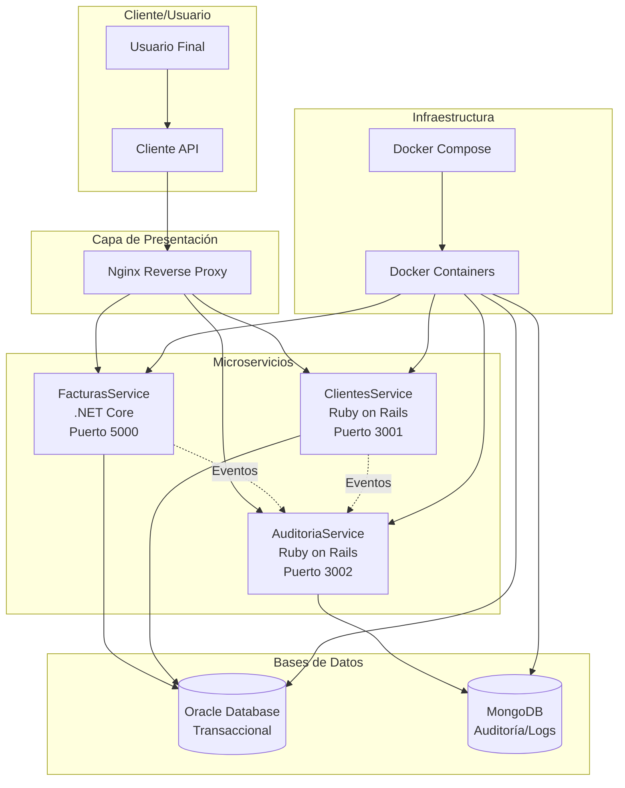
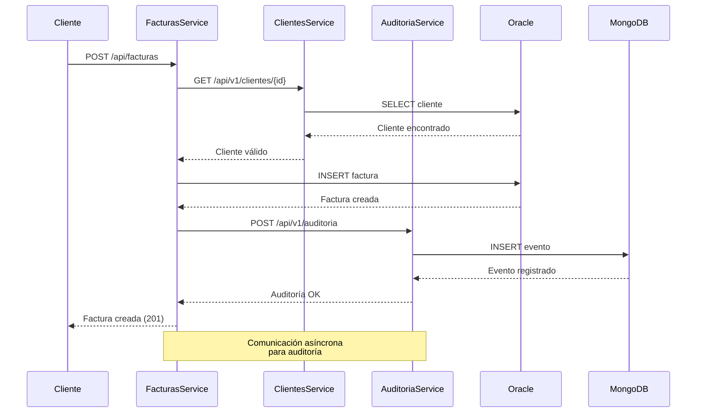
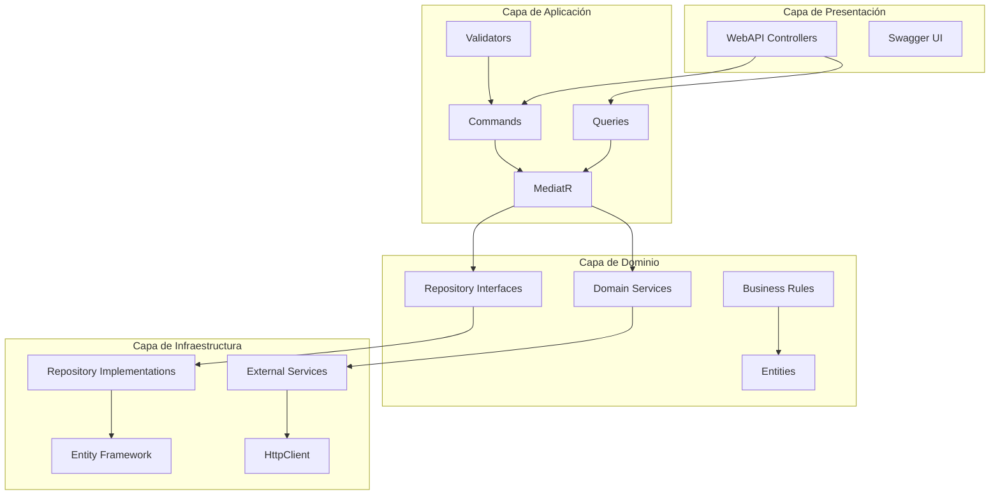
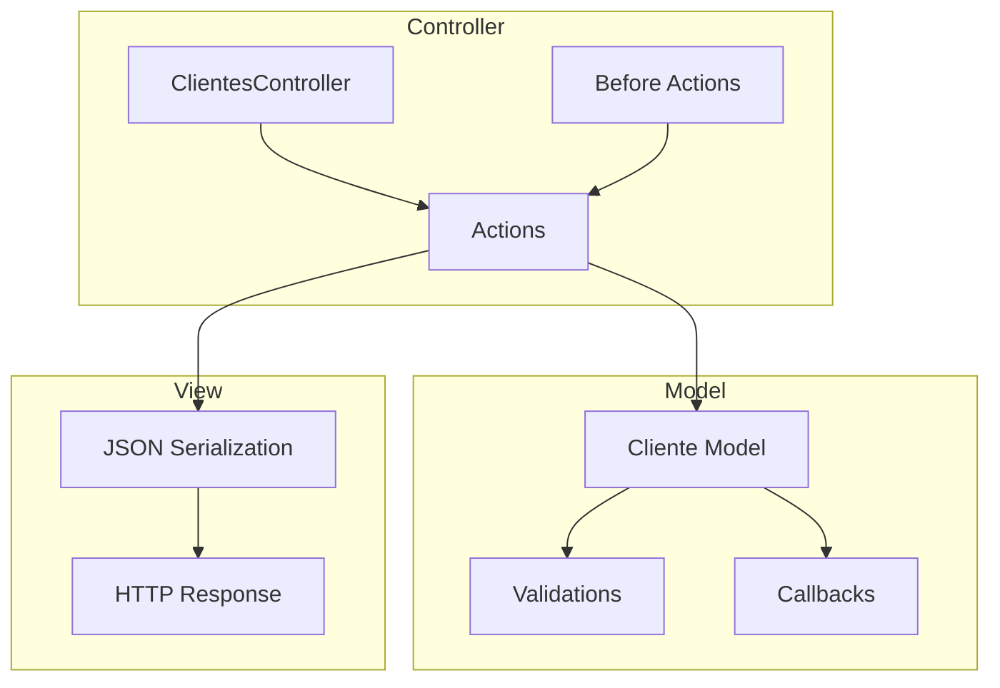
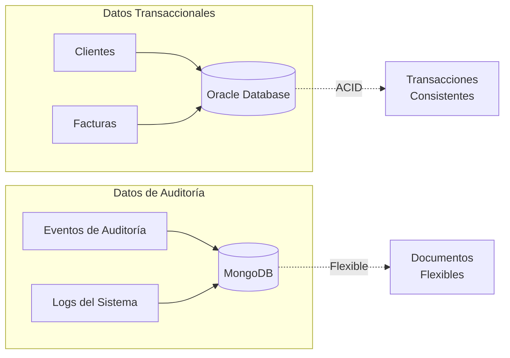

# Diagrama de Arquitectura - Sistema de Facturación Electrónica

## Diagrama de Alto Nivel

## Flujo de Comunicación Entre Servicios

## Arquitectura Clean Architecture - FacturasService

## Patrón MVC - ClientesService

## Estrategia de Persistencia

## Principios de Microservicios Aplicados

### 1. Independencia
- Cada servicio tiene su propia base de datos
- Despliegue independiente
- Tecnologías diferentes por servicio

### 2. Escalabilidad
- Servicios pueden escalarse horizontalmente
- Load balancing automático
- Recursos independientes

### 3. Resiliencia
- Circuit breakers para servicios externos
- Retry policies
- Fallback mechanisms

### 4. Observabilidad
- Logs centralizados
- Métricas de auditoría
- Health checks

## Comunicación Entre Servicios

### Síncrona (REST)
- Validación de cliente antes de crear factura
- Consultas inmediatas que requieren respuesta

### Asíncrona (Eventos)
- Registro de auditoría
- Notificaciones
- Procesamiento en background

## Consideraciones de Seguridad

### Autenticación
- Tokens JWT (implementación futura)
- Rate limiting
- Validación de permisos

### Protección de Datos
- Encriptación en tránsito
- Sanitización de inputs
- Validación estricta

## Monitoreo y Logs

### Health Checks
- Endpoint `/health` en cada servicio
- Verificación de conectividad a BD
- Estado general del servicio

### Auditoría
- Todos los eventos registrados
- Trazabilidad completa
- Análisis de patrones

## Escalabilidad Futura

### Integración con DIAN
- Servicio adicional para integración tributaria
- API externa de la DIAN
- Validación de documentos electrónicos

### Nuevas Funcionalidades
- Servicio de Notificaciones
- Servicio de Reportes
- Servicio de Configuración
